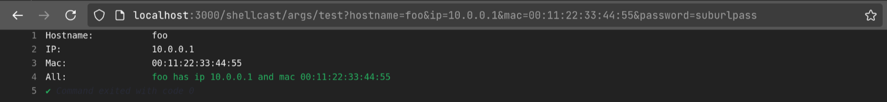

# ShellCast

A node app to stream multiple shell output realtime with args and highlighting.  

## Config

See [config-sample.yml](config-sample.yml)

### Rainbow

[tests/rainbow.sh](tests/rainbow.sh)

#### Console

http://localhost:3000/shellcast/rainbow


#### Plain

```bash
curl -s "http://localhost:3000/shellcast/rainbow/plain"
```


### Args

[tests/args.sh](tests/args.sh)

#### Console

http://localhost:3000/shellcast/args/test?password=suburlpass&hostname=toto&mac=tata&ip=192.168.0.1



#### Plain

```bash
curl -s "http://localhost:3000/shellcast/args/test/plain?password=suburlpass&hostname=toto&mac=tata&ip=192.168.0.1"
```


## Installation
```
git clone https://github.com/eoli3n/shellcast
cd shellcast
npm install
```
## Test
```
git clone https://github.com/eoli3n/shellcast
cd shellcast
cp config-sample.yml config.yml
SUBDIR=shellcast NODE_PORT=3000 node shellcast.js config.yml
```

### Reverse proxy with nginx
```
mkdir -p /opt/shellcast
#install
```
```
cat << EOF > /etc/nginx/sites-available/shellcast
server {
    root /var/www/html;
    listen      443 ssl;

    ssl_certificate      /etc/ssl/cert.crt
    ssl_certificate_key  /etc/ssl/cert.key;
    ssl_session_timeout 5m;
    ssl_protocols        TLSv1 TLSv1.1 TLSv1.2;
    ssl_ciphers          HIGH:!ADH:!MD5;
    ssl_prefer_server_ciphers on;

    # use SUBDIR here
    location /shellcast/ {
        add_header Access-Control-Allow-Origin *;
        proxy_set_header X-Real-IP $remote_addr;                      
        proxy_set_header X-Forwarded-For $proxy_add_x_forwarded_for;                                              
        proxy_set_header X-Forwarded-Proto $scheme;
        # use NODE_PORT here
        proxy_pass http://localhost:3000;
        proxy_http_version 1.1;
        proxy_set_header Upgrade $http_upgrade;
        proxy_set_header Connection 'upgrade';
        proxy_set_header Host $host;
        proxy_cache_bypass $http_upgrade;
        proxy_temp_path /tmp/data;
    }
}
EOF
```

```
ln -s /etc/nginx/sites-available/shellcast /etc/nginx/sites-enabled/shellcast
systemctl restart nginx
```

### Start NodeJS app with systemd
Create a service file in /etc/systemd/system/shellcast.service

```
[Unit]
Description=shellcast.js
After=network.target

[Service]
Type=simple
ExecStartPost=/bin/sh -c 'umask 022; pgrep node > /var/run/shellcast.pid'
Environment=NODE_PORT=3000
Environment=SUBDIR=shellcast
WorkingDirectory=/opt/shellcast
User=root
ExecStart=/usr/bin/node /opt/shellcast/shellcast.js /opt/shellcast/config.yml
Restart=on-failure

[Install]
WantedBy=multi-user.target
```
