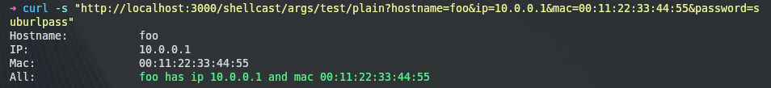

# ShellCast

A node app to stream multiple shell output realtime with args and highlighting.  
:exclamation: Shellcast defaultly perform in a "/shellcast" subdir now.
Change SUBDIR environment var to specify another web subdirectory.

## Examples

### Rainbow

``config.yml``
```
- name: Rainbow
  description: "Test word highlights and stream"
  url: /rainbow
  cmd: ./tests/rainbow.sh
  highlight:
    - word: 'white'
      class: white
    - word: 'hide'
      class: hide
    - word: 'gray'
      class: gray
    - word: 'red'
      class: red
    - word: 'orange'
      class: orange
    - word: 'yellow'
      class: yellow
    - word: 'purple'
      class: purple
    - word: 'blue'
      class: blue
    - word: 'green'
      class: green
    - line: '0.1'
      class: yellow
```
``tests/rainbow.sh``
```
 #!/bin/bash
for i in {0..20..1}
do
    echo "white hide gray hide red hide orange hide yellow hide purple hide blue hide green" 
    echo "...lets sleep 0.$i s"
    sleep 0.$i
done   
```


### Args

``config.yml``
```
- name: Args
  description: "Test args, suburls, password and plain text"
  url: /args/test
  password: suburlpass
  cmd: ./tests/args.sh {} {} {}
  args:
    - hostname
    - ip
    - mac
```
``tests/args.sh``
```
#!/bin/bash

printf "%-20s" "Hostname:"
printf "$1\n"
printf "%-20s" "IP:"
printf "$2\n"
printf "%-20s" "Mac:"
printf "$3\n"
```
#### Console
``http://localhost:3000/shellcast/args/test``

#### Plain
``http://localhost:3000/shellcast/args/test/plain``


## Installation
```
git clone https://github.com/eoli3n/shellcast
cd shellcast
npm install
```
## Test
```
node shellcast.js config.yml
```
Then access to 
- http://localhost:3000/shellcast/args/test?password=suburlpass&hostname=toto&mac=tata&ip=192.168.0.1
- http://localhost:3000/shellcast/args/test/plain?password=suburlpass&hostname=toto&mac=tata&ip=192.168.0.1

## Configuration
Please read [config.yml](config.yml)

### Configure with nginx
```
mkdir -p /opt/shellcast
##install
```
```
cat << EOF > /etc/nginx/sites-available/shellcast
server {
    root /srv/node/shellcast;
    listen      443 ssl;

    ssl_certificate      /etc/ssl/cert.crt
    ssl_certificate_key  /etc/ssl/cert.key;
    ssl_session_timeout 5m;
    ssl_protocols        TLSv1 TLSv1.1 TLSv1.2;
    ssl_ciphers          HIGH:!ADH:!MD5;
    ssl_prefer_server_ciphers on;

    location /shellcast/ {
        add_header Access-Control-Allow-Origin *;
        proxy_pass http://localhost:3000;
        proxy_http_version 1.1;
        proxy_set_header Upgrade $http_upgrade;
        proxy_set_header Connection 'upgrade';
        proxy_set_header Host $host;
        proxy_cache_bypass $http_upgrade;
        proxy_temp_path /tmp/data;
    }
}
EOF
```

```
ln -s /etc/nginx/sites-available/shellcast /etc/nginx/sites-enabled/shellcast
systemctl restart nginx
```

### Start NodeJS app with systemd
Create a service file in /etc/systemd/system/shellcast.service

```
[Unit]
Description=shellcast.js
After=network.target

[Service]
Type=simple
ExecStartPost=/bin/sh -c 'umask 022; pgrep node > /var/run/shellcast.pid'
Environment=NODE_PORT=3000
Environment=SUBDIR=shellcast
WorkingDirectory=/opt/shellcast
User=root
ExecStart=/usr/bin/node /opt/shellcast/shellcast.js /opt/shellcast/config.yml
Restart=on-failure

[Install]
WantedBy=multi-user.target
```
